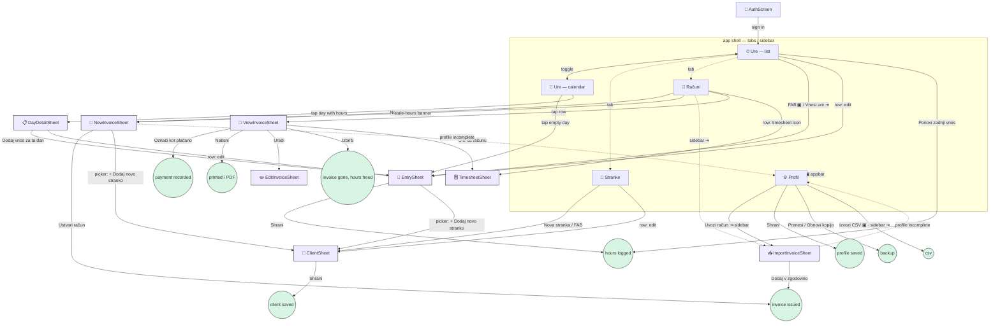
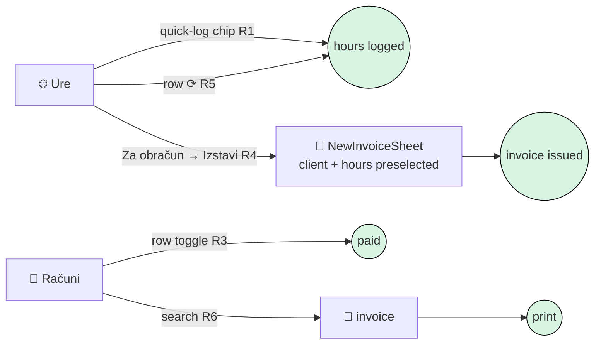

# Interaction graph — what Reckon lets you do, and what it costs

Working notes, not a deliverable. Everything below was read off the code as it
stands (App.tsx, the four views, the eight sheets), not off the design intent.

The question this answers: **for each thing a user actually wants, how many
interactions does the app charge them, and what is the floor?**

---

## 1. Capability inventory

Every action the interface exposes, grouped by the object it acts on.

| # | Capability | Where it lives | Entry points |
| --- | --- | --- | --- |
| C1 | Register / sign in / sign out | `AuthScreen`, sidebar, profile | 1 |
| C2 | Edit issuer profile | `ProfileView` | sidebar, phone appbar, readiness gates |
| C3 | Back up / restore the ledger | `ProfileView` | 1 |
| C4 | Export invoices to CSV | sidebar (desktop), profile (phone) | 2 |
| C5 | Add a client | `ClientSheet` | Stranke, FAB, **inline from any client picker** |
| C6 | Edit a client / change rate | `ClientSheet` | Stranke row |
| C7 | Deactivate / reactivate a client | `ClientsView` | Stranke row |
| C8 | Log worked hours | `EntrySheet` | FAB, "Vnesi ure", empty calendar day, day sheet |
| C9 | Repeat the last entry onto today | `TrackView` | 1 (list view only) |
| C10 | Edit / delete an entry | `TrackView`, `DayDetailSheet` | row icons |
| C11 | Review hours as a list, filtered by client | `TrackView` | chips |
| C12 | Review hours as a month calendar | `CalendarView` | tab toggle |
| C13 | See a day's entries | `DayDetailSheet` | calendar cell |
| C14 | Generate an invoice from unbilled hours | `NewInvoiceSheet` | Računi, FAB, stale-hours banner |
| C15 | Record an invoice issued elsewhere | `ImportInvoiceSheet` | sidebar / profile |
| C16 | View an invoice document | `ViewInvoiceSheet` | Računi row |
| C17 | Mark paid / unpaid | `ViewInvoiceSheet` | inside C16 |
| C18 | Edit an invoice | `EditInvoiceSheet` | inside C16 |
| C19 | Print an invoice (+ UPN QR) | `ViewInvoiceSheet` | inside C16 |
| C20 | See the timesheet behind an invoice | `TimesheetSheet` | inside C16, Računi row |
| C21 | Delete an invoice (unbills its hours) | `ViewInvoiceSheet` | inside C16 |

**Not present:** e-mail delivery, invoice search/filter, date-range filter on
hours, any keyboard shortcut, any bulk action.

---

## 2. The graph

Nodes are things that occupy the screen. Edges are what a user does to move
between them. `⇥` marks an edge that exists only on desktop, `▣` only on phone.

Shape of the graph, in one sentence: **every goal is reached by opening a panel
from a list, and every panel is reached from exactly one list.** That is tidy,
and it is also the source of most of the cost below — the lists are pure
navigation, and navigation is what you pay twice a day.

---

## 3. Cost per goal

"Interactions" counts taps/clicks and discrete field entries. *Floor* is what
the same goal would cost if the app were arranged around it. Frequency is for a
working freelancer.

| Goal | Frequency | Path today | Now | Floor | Δ |
| --- | --- | --- | --- | --- | --- |
| **G1** Log today's hours, same as usual | daily | FAB → sheet (client ✓ default, date ✓ today, 09:00–17:00 default) → fix start (3) → fix end (3) → Shrani | **9** | 1 | **−8** |
| G1b … via *Ponovi zadnji vnos* | daily | Ure → Ponovi | 2 | 1 | −1 |
| **G2** Log hours for a past day | weekly | Ure → Koledar → (month) → day → 5 fields → Shrani | 9–11 | 4 | −6 |
| **G3** Bill one client for everything unbilled | monthly | Računi → Nov račun → client (2) → dates ✓ → Ustvari | **5** | 2 | −3 |
| **G4** Mark an invoice paid | ~monthly ×n | Računi → row → Označi plačano → Zapri | **4** | 1 | −3 |
| **G5** Print / send an invoice | monthly ×n | Računi → row → Natisni → (OS dialog) | 3 | 2 | −1 |
| **G6** See what's unbilled, per client | weekly | Ure → chip per client, read total, repeat | **1 + n** | 1 | −n |
| **G7** Correct yesterday's entry | weekly | Ure → find row → edit → field → Shrani | 5 | 4 | −1 |
| **G8** Change a client's rate | rare | Stranke → edit → rate → Shrani | 4 | 4 | 0 |
| **G9** Find invoice 007/2026 | occasional | Računi → scroll (no search) | 1 + scroll | 2 | — |
| **G10** First run to first invoice | once | register → profile (13) → client (8) → hours (5) → invoice (5) | **~35** | ~20 | −15 |

The three that matter, by frequency × cost: **G1, G4, G3.**

---

## 4. Where the steps actually go

**F1 — Time entry is the app's hot path and its slowest form.**
`TimeField` costs three interactions per time (open → hour → minute), so a
shift that isn't exactly 09:00–17:00 costs six before anything else. The
defaults are fixed constants, not what this user does: someone who works
06:00–14:00 pays that tax every single day.

**F2 — "Ponovi zadnji vnos" is the right idea in the wrong place.**
It repeats *the globally last* entry onto *today*, appears only in list view,
and vanishes in calendar view. It can't repeat onto a chosen day, and it can't
repeat a *client's* usual shift when the last entry was for someone else.

**F3 — Marking paid requires opening a document to press one button.**
Payment status is the single most-mutated field on an invoice, and it is three
levels deep. The list already draws the status as a coloured spine — it just
isn't touchable.

**F4 — Billing starts from the wrong noun.**
The user thinks *"bill Nordis for August"*; the app asks them to open Računi,
then say *Nordis* again in a picker. Meanwhile Ure knows exactly which clients
have unbilled hours and shows a total — with no way to act on it. The
stale-hours banner on Računi is the one place that does this well, and it only
fires for hours older than this month.

**F5 — Unbilled work per client is invisible without hunting.**
`TrackView` shows one aggregate "neobračunano" figure. Answering "who owes me an
invoice?" means tapping every client chip in turn.

**F6 — The invoice list has no search, no filter, no year grouping.**
At the 300-invoice scale the requirements assume, this is a scroll.

**F7 — Desktop has a mouse and no keyboard.**
Every action is a click on a target; nothing responds to a key. The one screen a
freelancer opens every evening deserves `n`.

**F8 — First run is a 35-step cliff with no guidance.**
Nothing tells a new account what order to do things in; the readiness banner
only appears once they try to invoice.

---

## 5. The optimal arrangement

Ranked by (frequency × steps saved) ÷ effort.

### R1 — Make the hot path one tap: *quick-log chips* ★★★ — **built**
On Ure, above the list: one chip per **remembered shift**, derived from that
client's own history (`Nordis · 06:00–14:00`). Tapping logs it for today;
long-press/⌥-click opens the sheet prefilled for editing. Derived from data
already loaded, no new storage.
**G1: 9 → 1.**

### R2 — Seed the entry sheet from the client's last shift ★★★ — **built**
When `EntrySheet` opens, default start/end to that client's most recent entry
instead of 09:00–17:00, and re-default when the client changes. The constants
are a guess; the history is evidence.
**G1 (when the sheet is needed): 9 → 3.**

### R3 — Payment toggle on the invoice row ★★★ — **built**
A checkbox-style control on the right of each row in `InvoicesView`: unpaid →
tap → paid, with an undo toast. Never opens the document.
**G4: 4 → 1.**

### R4 — "Za obračun" strip on Ure ★★ — **built**
Under the totals, one line per client with unbilled hours:
`Nordis · 24,0 h · 720,00 € → Izstavi račun`. The button opens
`NewInvoiceSheet` with the client already chosen and its sessions checked.
Answers G6 at a glance and turns G3 into two taps from the screen the user is
already on.
**G6: 1+n → 1. G3: 5 → 2.**

### R5 — Repeat, in context ★★
Move repeat onto the row (`⟳` on any entry = copy to today) and onto the
calendar day sheet (`⟳` = copy that entry to the day being viewed). Keeps the
existing button for the global case.
**G2 for a recurring shift: 9 → 3.**

### R6 — Invoice list: search + status filter + year headings ★★
A single text field matching number and client name, three status chips
(vse / odprti / plačani), and a `2026` divider between years. Same pattern as
the client chips on Ure, so nothing new to learn.
**G9: scroll → 2.**

### R7 — Keyboard on desktop ★
`n` new entry · `r` repeat last · `i` new invoice · `/` focus search ·
`g` then `u`/`s`/`r` to switch tabs · `Esc` already closes. One handler in
`App.tsx`, ignored while a field has focus.

### R8 — Guided first run ★
Replace the three separate empty states with one checklist on Ure:
*1 Izpolnite profil · 2 Dodajte stranko · 3 Zabeležite ure · 4 Izstavite račun*,
each line a button, each ticking itself off. Uses `invoiceReadiness` plus two
`length` checks — no new state, no onboarding flag.
**G10: ~35 → ~20, and none of it guesswork.**

### R9 — Duration nudges in the time fields ★
Next to `TimeField`, three chips: `+30 min` `+1 h` `−1 h`, adjusting the end
relative to the start. Cheapest fix for the "07:15–15:45" case.

### R10 — Send by e-mail ✚
The one genuinely missing capability (FR8.3). Until it exists, *Natisni* →
save as PDF → mail client is a five-app round trip that the graph above can't
even show.

---

## 6. What the graph looks like afterwards

The edges that disappear are the navigational ones — the parts where the user
tells the app where they are rather than what they want:

Three of the four daily and monthly goals become **one interaction from the
screen the user is already looking at**, and the sheets stop being the only way
to get anything done — they become what you open when the default is wrong.

---

## 6a. Built — R1 to R4

Landed in `lib/suggestions.ts` (all four derive from data already loaded, so
nothing new is stored), `TrackView`, `EntrySheet` and `InvoicesView`.

| Goal | Before | After |
| --- | --- | --- |
| G1 log a usual shift | 9 | **1** |
| G1 via the form, other times | 9 | **3** |
| G4 mark an invoice paid | 4 | **1** |
| G3 bill a client from the hours screen | 5 | **2** |
| G6 see who is owed an invoice | 1 + n | **1** |

Notes on what shipped versus what was sketched:

- The chips replace *Ponovi zadnji vnos* rather than sitting beside it. The old
  button was the same idea restricted to one global entry; the first chip is
  that entry, and the others are the clients it used to hide.
- A chip offers the shift a client is worked **most often**, not most recently,
  so one odd afternoon doesn't displace the usual morning.
- Tapping the same chip twice on one day is refused with a toast. A duplicated
  entry is money on an invoice, not a stray row.
- Deactivated clients get no chip, but *do* appear in "Za obračun" — stopping
  work for someone is exactly when their last invoice is due.
- The payment control did **not** replace the status badge. "Zapadlo" is a
  state, not an action, and the row still says it; the action sits beside it.

Still open from the list above: R5 (repeat in context), R6 (invoice search),
R7 (keyboard), R8 (guided first run), R9 (duration nudges), R10 (e-mail).

## 7. Deliberately not changing

- **The sheet-per-object structure.** It is consistent and it prints; the fix is
  to make sheets *optional* for the common case, not to replace them.
- **The readiness gate.** It costs steps on purpose — an invoice missing its
  issuer's tax number is not a valid invoice.
- **Confirmation on destructive actions.** Deleting an invoice unbills its
  hours; that deserves the extra tap.
- **The receipt layout.** Unchanged since it was ported, by request.
